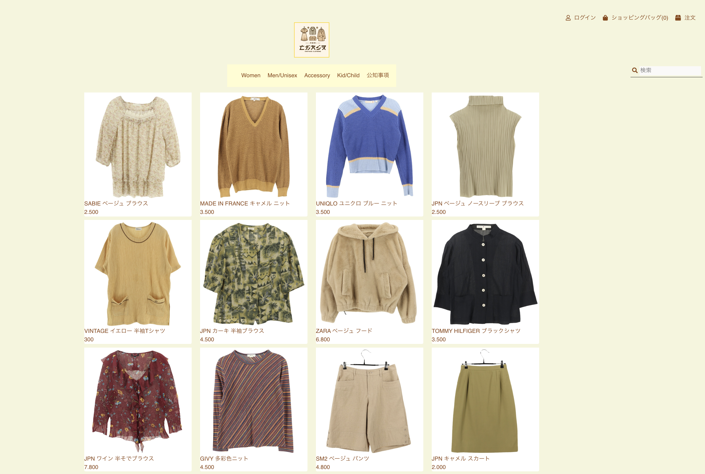
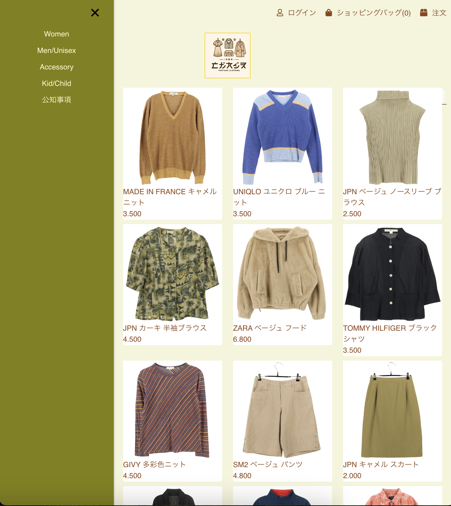
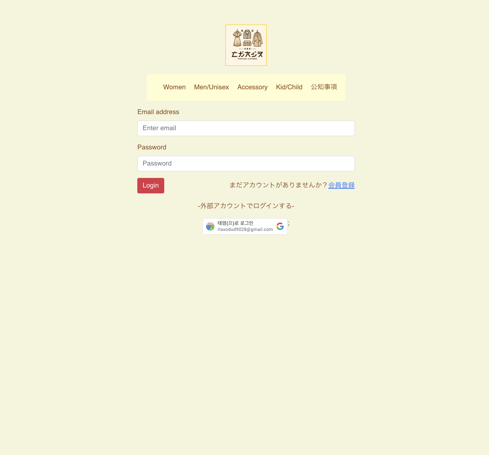
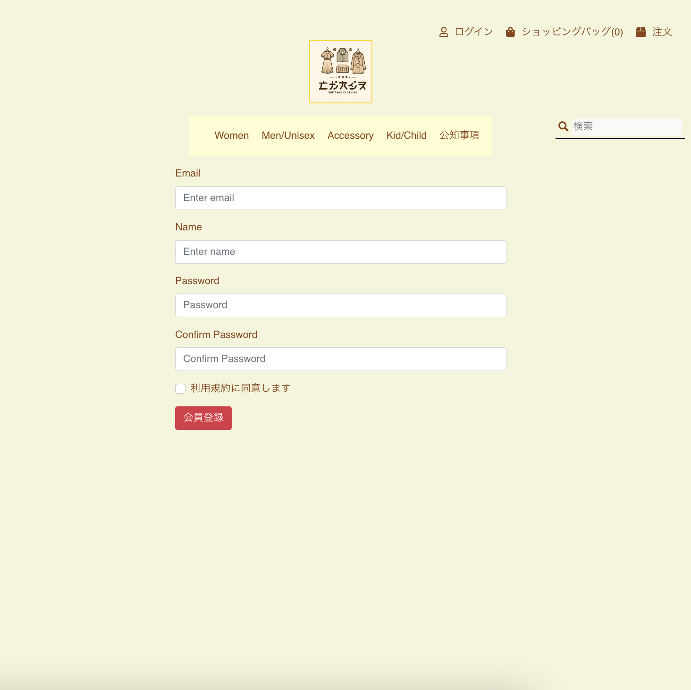

# VINTAGE SHOP

ビンテージ衣類ショッピングモールであり、ビンテージ衣類文化に対する交流ができるウェブサイトです。
---
## 紹介

私は日本に住んでいて、ウェブ開発者として活動しています。 休日ごとに東京と東京郊外の多様な都市を探訪しながらビンテージ衣類ショップに魅了されビンテージ衣類ショッピングモールウェブサイトを開発するようになりました。 このショッピングモールはビンテージファッションを愛する人々の間でコミュニティを形成し、ビンテージ衣類の再利用とリサイクルを通じて持続可能なファッションと環境保護に寄与しようとしています。

## Tech Stack
開発環境


## 開発ツール
Frontend


Backend

https://github.com/formal369/shoppingmall_be


## Architecture

Frontend
```
.vscode/
  settings.json
node_modules/
public/
  image/
  _redirects
  favicon.ico
  index.html
  logo192.png
  logo512.png
  manifest.json
  robots.txt
src/
  action/
    cartAction.js
    commonUiAction.js
    noticeAction.js
    orderAction.js
    productAction.js
    reviewAction.js
    userAction.js
  component/
    CartProductCard.js
    Navbar.js
    NewItemDialog.js
    OrderDetailDialog.js
    OrderReceipt.js
    OrderStatusCard.js
    OrderTable.js
    PaymentForm.js
    ProductCard.js
    ProductTable.js
    ReviewSection.js
    SearchBox.js
    Sidebar.js
    ToastMessage.js
  constants/
    cart.constants.js
    commonUI.constants.js
    notice.constants.js
    order.constants.js
    product.constants.js
    review.constants.js
    user.constants.js
  Layout/
    AppLayout.js
  page/
    ProductAll.js
    ProductDetail.js
    RegisterPage.js
  reducer/
    cartReducer.js
    commonUIReducer.js
    noticeReducer.js
    orderReducer.js
    productReducer.js
    reviewReducer.js
    store.js
    userReducer.js
  routes/
    AppRouter.js
    PrivateRoute.js
  style/
    adminOrder.style.css
    adminProduct.style.css
    cart.style.css
    common.style.css
    login.style.css
    orderStatus.style.css
    paymentPage.style.css
    productDetail.style.css
    register.style.css
    review.style.css
  utils/
    api.js
    CloudinaryUploadWidget.js
    number.js
  App.css
  App.js
  App.test.js
  index.css
  index.js
  logo.svg
  reportWebVitals.js
  setupTests.js
.env
.gitignore
package-lock.json
package.json
README.md
test.js
```

Backend

https://github.com/formal369/shoppingmall_be
```
.vscode/
controllers/
  auth.controller.js
  cart.controller.js
  notice.controller.js
  order.controller.js
  product.controller.js
  review.controller.js
  user.controller.js
models/
  Cart.js
  Notice.js
  Order.js
  Product.js
  Review.js
  User.js
node_modules/
routes/
  auth.api.js
  cart.api.js
  index.js
  notice.api.js
  order.api.js
  product.api.js
  review.api.js
  user.api.js
utils/
  randomStringGenerator.js
.env
.gitignore
app.js
package-lock.json
package.json
```

## Features
1. Main Page



2. Login Page


3. Register Page


## TODO
1. 多言語対応(i18n)
2. ポイントとリワードシステムです
3. プロモーションおよび割引コードです
4. リアルタイムチャット対応です
5. ウィッシュリスト